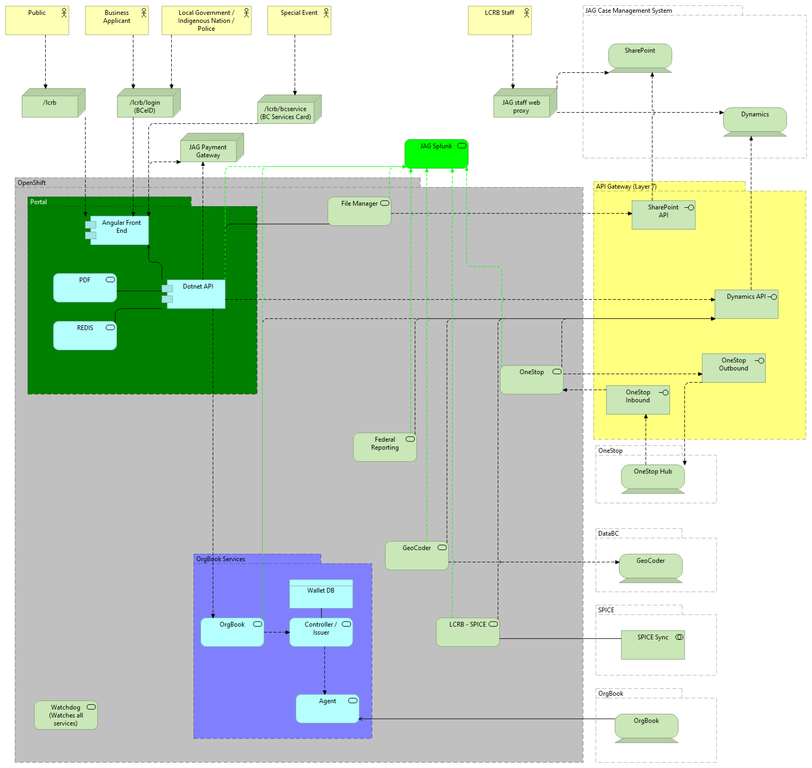

BC Liquor and Cannabis Regulation Branch - Liquor and Cannabis Licensing Application
======================
[]

Technology Stack
-----------------

| Layer   | Technology | 
| ------- | ------------ |
| Presentation | Angular 11 |
| Business Logic | C Sharp - Dotnet Core 5.0 |
| Microservices | C Sharp - Dotnet Core 5.0 |
| Job Scheduling | [Hangfire](http://hangfire.io) |
| Front End Web Server | Nginx |
| Application Server | Kestrel |
| Data Storage | MS Dynamics On Premise V9 |
| Authentication | ADFS, BCeID, BC Services Card |
| Document Storage    | MS SharePoint 2016 |
| Container Platform | OpenShift 4 |
| Zero Trust Security Policy Type | Kubernetes |
| Logging | Splunk, Console, MS Teams and Kibana |
| CI/CD Pipeline | Jenkins, Github Actions |

System Architecture
--------------

Repository Map
--------------
- **.s2i**: Source to image (s2i) assembly script
- **cllc-interfaces**: Interface libraries for other systems:
  - BCeID
  - BC Express Pay (BCEP)
  - BC Registries
  - Microsoft Dynamics
  - Microsoft SharePoint
- **cllc-interfaces-test**: Automated tests for the above interface libraries
- **cllc-public-app**: Source code for the public facing application
- **cllc-public-app-test**: Automated tests for the public application
- **federal-reporting**: Image source for a service used to handle monthly reports to the federal government
- **file-manager**: Image source for a file manager used to handle communications with SharePoint
- **functional-tests**: Source for BDD tests
- **openshift**: Various OpenShift related material, including instructions for setup and templates.
- **pdf-service**: A PDF generator
- **sep-service**: Special Event Permit data collector
- **watchdog**: Image source for a watchdog that can monitor the dependency tree of the application

Installation
------------
This application is meant to be deployed to RedHat OpenShift version 4. Full instructions to deploy to OpenShift are in the `openshift` directory.

Developer Prerequisites
-----------------------

**Public Application**
- .Net Core SDK (5.0)
- Node.js version 10.21 
- .NET Core IDE such as Visual Studio or VS Code
- JAG VPN with access to MS Dynamics

**DevOps**
- RedHat OpenShift tools
- Docker
- A familiarity with Jenkins

Dynamic Forms
-------------------------
The portal supports the use of Dynamic Forms, in other words, forms that are specified through the creation of a custom form in MS Dynamics.

To use this feature, first create a new Application Form in MS Dynamics.  You may use tabs and sections to organize the form, although the layout will be flattened when sent to the portal.

If you add new fields to MS Dynamics, the following steps will need to be done in order for the new fields to appear in the portal:

1.  Update Dynamics Models to contain the new fields.  This should be done by running the code generation script.  Do not edit the model by hand.
2.  Add view model fields for each new field.  Be sure to use the same datatype; for example, if Dynamics uses a lookup with integer values, use a nullable int (int?). If Dynamics uses a nullable bool (bool?), use a nullable bool in the view model.  
3.  Add code to "copy values" and "to view model" routines for the application extension class.  Since the data types match this should be trivial, just add code to copy from the Dynamics field to the view model and vice versa.
4.  Add rows to the ApplicationMapping class to denote the new fields.  This should contain the Dynamics field name (actual field name not the display name) and the name of the view model field, as it will be sent to the client.  Note that the first character of the model will be lowercase.
5.  Add fields to the Client model that correspond to fields in the View Model.  Note that the first character should be lower case, as the Dotnet JSON parser will convert the first character of the field name to lower case, and so the Client code will need to use that.
6.  Add logic or field definitions to the relevant Validation code.  This will prevent a generic error which may be confusing to the user from being shown.  

Be sure to test a round trip (save and load) before considering the field mapping done.

Microsoft Dynamics, SharePoint
---------------------------
A MS Dynamics instance containing the necessary solution files is required.  A SharePoint connection is optional.  If no SharePoint connection is available then file operations will not be executed.

Define the following secrets in your development environment (secrets or environment variables):
1. DYNAMICS_NATIVE_ODATA_URI: The URI to the Dynamics Web API endpoint.  Example:  `https://<hostname>/<tenant name>/api/data/v9.0/`.  This URI can be a proxy.
2. DYNAMICS_NATIVE_ODATA_URI: The native URI to the Dynamics Web API endpoint, in other words as the server identifies itself in responses to WebAPI requests.  Do not put a proxy URI here.
3. SSG_USERNAME: API gateway username, if using an API gateway
4. SSG_PASSWORD: API gateway password, if using an API gateway
5. DYNAMICS_AAD_TENANT_ID: ADFS Tenant ID, if using ADFS authentication.  Leave blank if using an API gateway
6. DYNAMICS_SERVER_APP_ID_URI: ADFS Server App ID URI. Leave blank if using an API gateway
7. DYNAMICS_CLIENT_ID: Public Key for the ADFS Enterprise Application app registration. Leave blank if using an API gateway
8. SHAREPOINT_ODATA_URI: Endpoint to be used for SharePoint, exclusive of _api.  Can be a proxy.  Leave blank if not using SharePoint.
9. SHAREPOINT_NATIVE_BASE_URI:  The SharePoint URI as configured in SharePoint.  Do not set to a proxy.
10. SHAREPOINT_SSG_USERNAME, SHAREPOINT_SSG_PASSWORD - optional API Gateway credentials for SharePoint
11. SharePoint may also use the same ADFS credentials as Dynamics.  If that is to be used, leave all SSG parameters empty or undefined.

Mac Environment
---------------
A Mac computer can be used for development.  The easiest way to prepare the Mac for development is to install Visual Studio 2019 for Mac.  

Prior to running the application for the first time, change directory to the "ClientApp" sub directory of cllc-public-app and execute `npm install`.  This will allow the node dependencies for the software to be downloaded.

A script `go-cllc.sh` has been provided to allow the application to be run on a mac.

Edit this file with the various settings you need to run the application.

If you wish to use a port other than 50001 for the app, change the last line to:

dotnet run --server.urls http://0.0.0.0:5000

(Where 5000 is your chosen port).

Note that for development purposes you should set ASPNETCORE_ENVIRONMENT to Development

(It can be set to Staging or Production after you execute a dotnet publish command to build static files)

DevOps Process
-------------

## Pipelines

This project no longer uses Jenkins; pipelines for key operations have been converted to Tekton, which run as native pipelines in OpenShift.

## DEV builds
Dev builds are triggered by source code being committed to the repository.  This process triggers a webhook which initiates the DEV build pipeline.

Login to the OpenShift Web Console and navigate to the Tools project for the system, and view the status of the "dev-build" pipeline build to see the status of the build.

## TEST Builds
Merge code to the "master" branch from the "develop" branch to trigger a TEST build.

TEST builds are triggered by source code being committed to the master branch of the repository.  This process triggers a webhook which initiates the TEST build pipeline.

Login to the OpenShift Web Console and navigate to the Tools project for the system, and view the status of the "uat-build" pipeline to see the status of the build. 

## Promotion to PROD
Login to the OpenShift Web Console and navigate to the Tools project for the system.  Go to the Pipelines section and find the "promote-prod" Pipeline.  Click the Start option to start the pipeline. 

## Hangfire
This system makes use of Hangfire for scheduling.  More information on Hangfire can be found at the website [hangfire.io](https://hangfire.io); the system uses a stock configuration of Hangfire.

To login to a hangfire dashboard, forward traffic from the OpenShift pod for the service you wish to see the dashboard for, and access http://localhost:8080

`oc port-forward <POD NAME> 8080:8080`

## Builds for supporting microservices

Supporting microservices such as the PDF service, File Manager, Geocoder, OneStop etc are built by starting the related Build Config.

Navigate to Build Configs in the OpenShift web console, click on the given Build Config, and start the build with the Actions menu in the upper right hand side of the page.
Note that you will need to Tag the given build using the CLI if your intent is to deploy to TEST or PROD.

The CLI command sequence for this is:

`oc project <TOOLS NAMESPACE>`
`oc tag <IMAGENAME>:latest <IMAGENAME>:test`
`oc tag <IMAGENAME>:latest <IMAGENAME>:prod`

For example, to promote an image for the PDF service to PROD, the command would be:
`oc tag pdf-service:latest pdf-service:prod`

Once the image has been tagged you can verify deployment by navigating to the related Deployment Config in the web console.

## Feature Management
Features are managed by adding environment variables (or secrets in the case of a developer's PC) to the API environment.  As a general rule the environment variable name should begin with FEATURE_ and be all caps.  Empty string for a value is the same as not being set; anything other than empty string will set the value.

For a list of features that are active in a given instance access /api/features.

To edit an environment variable, go to the environment tab on the Deployment Config for the API service associated with the given instance.

Contribution
------------

Please report any [issues](https://github.com/bcgov/jag-lcrb-carla-public/issues).

[Pull requests](https://github.com/bcgov/jag-lcrb-carla-public/pulls) are always welcome.

If you would like to contribute, please see our [contributing](CONTRIBUTING.md) guidelines.

Please note that this project is released with a [Contributor Code of Conduct](CODE_OF_CONDUCT.md). By participating in this project you agree to abide by its terms.

License
-------

    Copyright 2021 Province of British Columbia

    Licensed under the Apache License, Version 2.0 (the "License");
    you may not use this file except in compliance with the License.
    You may obtain a copy of the License at 

       http://www.apache.org/licenses/LICENSE-2.0

    Unless required by applicable law or agreed to in writing, software
    distributed under the License is distributed on an "AS IS" BASIS,
    WITHOUT WARRANTIES OR CONDITIONS OF ANY KIND, either express or implied.
    See the License for the specific language governing permissions and
    limitations under the License.

Maintenance
-----------

This repository is maintained by [BC Attorney General]( https://www2.gov.bc.ca/gov/content/governments/organizational-structure/ministries-organizations/ministries/justice-attorney-general ).

