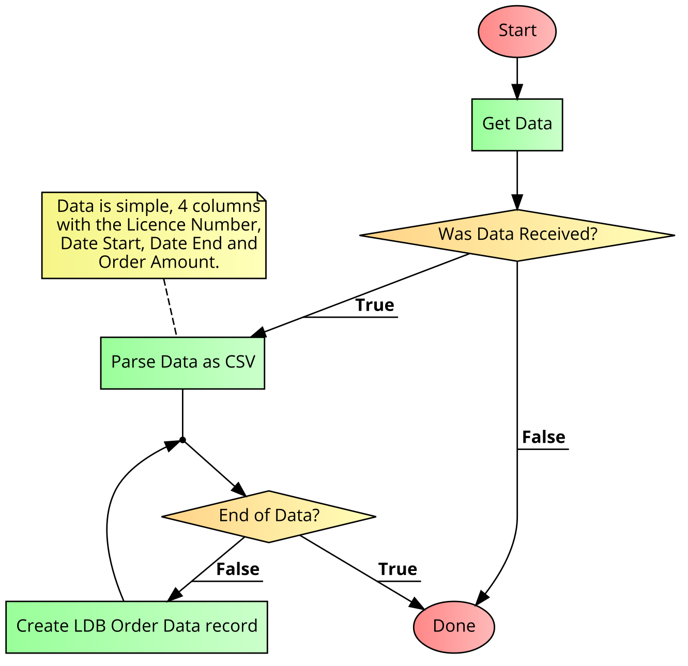

# LDB Orders Service

The purpose of the LDB Orders microservice is to parse monthly order reports and insert them into the LDB Orders entity in MS Dynamics

## Design

The main input to the system is a text file that is available on the LDB SCP server.

A scheduled job checks for this file, and if it is present it will import the data.

## Development

This service is a Dotnet Core 5.0 application.  As such you can use a C# IDE such as Visual Studio or VS Code to edit the files.  

## Testing

This section describes concepts and tools necessary for testing the service.

### Hangfire
This system uses the Hangfire system of job scheduling.

Hangfire login is restricted to those with local access.  To obtain local access:

1. Local development
	1. Run the service locally, after configuring appropriate secrets.
	2. Navigate to /hangfire after the application starts.  If you launch from visual Studio it should go to this URL by default.
3. OpenShift deployment
	1. Open a CLI session to the given OpenShift cluster
	2. Use `oc project <project>` to change to the project namespace containing the instance of the service you wish to control
	3. Use `oc get pods` to get a list of running pods.
	4. Use `oc port-forward <podname> 8080:8080` to forward port 8080 from the container running the service to localhost.  Note that you must not have an existing service using port 8080.
	5. Navigate to `http://localhost:8080/hangfire` in a browser.

Once on the hangfire console you may view the status of jobs, and trigger a new job.

###Secrets

The following secrets can be used to adjust the configuration of the service:

| Secret    | Purpose |
| --- | --- |
| DEBUG_MODE | Enables extra logging |
| LDB_URL | Host used for SCP connection to LDB |
| LDB_USERNAME | Username for LDB    |
| LDB_PASSWORD | Password for LDB    |
| DYNAMICS_ODATA_URI | ODATA URI for MS Dynamics.  Leave blank to disable Dynamics portion of the service |

| SPLUNK_COLLECTOR_URL | Full URL for the Splunk collector |
| SPLUNK_TOKEN | Splunk access token |
| SPLUNK_CHANNEL | Splunk channel |
| ENABLE_HANGFIRE_JOBS | Controls whether or not the hangfire job runs. |

