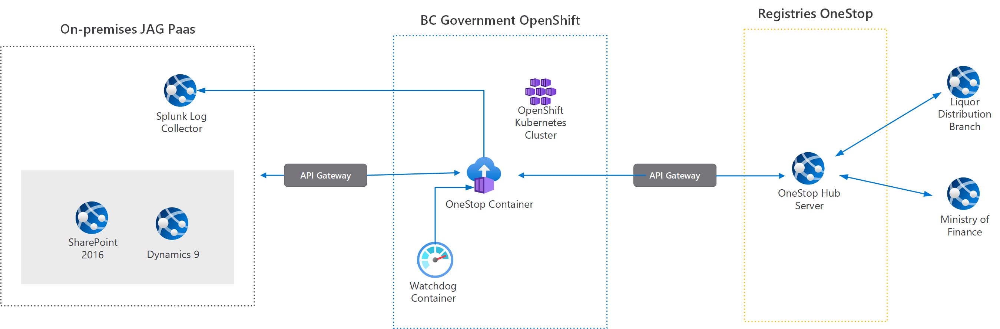

# OneStop Service

The purpose of the OneStop microservice is to send messages to the OneStop Hub that result from actions in the case management system.  These actions include:
* New licence is issued
* Licence expires
* Licence transfer is started, and transfer complete
* Licence is suspended, and suspension removed
* Licence is cancelled, and cancellation removed
* Licence is made dormant, and dormancy removed

The Microsoft Dynamics 

## Design


There are three distinct areas in the system:
* The Justice Attorney General Platform as a service Case Managment system (Microsoft Dynamics and SharePoint)
* The BC Government OpenShift Kubernetes Cluster
* The BC Government Registries OneStop Hub system

Each area is linked to the others through the Justice API Gateway, an appliance that is used to control network access among systems.  

The code within this repostory is for the OneStop Service Container. This service does the work of scheduling and initiating communication to the OneStop Hub, and also will process inbound messages from the OneStop hub.

Outbound messages to the OneStop hub are sent using a REST service, with an XML payload.  The REST service mimics the behavior of a legacy SOAP service.

Inbound messages are received using a SOAP protocol, using a similar XML payload.

###Message Timing

Message response times will vary.  

For operations that are atomic, such as a Change Status message, the message is simply sent to the REST service, and the response is parsed immediately.  The server response will either be to confirm that a valid change status was received or an error was found.

Other operations that have a time component will have different behavior.  For example a Program Account Detail (on new / updated licence) message may go back and forth several times with the OneStop hub as the payload is negotiated.  This can take several minutes and possibly more than an hour.

Operations that rely on a third party, such as Ministry of Finance, may take even longer. This may cause a delay of more than a day before a message is relayed to a final destination such as the Liquor Distribution Board.

## Development

This service is a Dotnet Core 5.0 application.  As such you can use a C# IDE such as Visual Studio or VS Code to edit the files.  

## Testing

This section describes concepts and tools necessary for testing the service.

### Curl

Curl is a command line tool for sending HTTP requests.  

The website for Curl is https://curl.haxx.se

### Authorization

If using the web based "SwaggerUI" interface, accessible at the `<Microservice Base URL>/swagger URL` of the service, there is an Authorize button available that will mimic the behavior of the following.

To obtain an Authorization token, access the following URL:

```
<Microservice Base URL>/api/authentication/token?secret=<SECRET>
```

Note that if your route is using a self signed certificate, you will need to use the -k parameter with Curl to disable certificate validation.

Substitute <SECRET> with the value for the JWT Token Key for the environment.  The token endpoint will only provide a token if the secret provided matches that in the application configuration.

The lengthy string of characters at the start of the response is the token, followed by an expires declaration.  Copy the first string and use that as your token.

### JWT Authentication

The PDF Microservice uses Json Web Token (JWT) authentication for the REST API server.

JWT authentication is implemented using the "Authentication" header, consisting of "Bearer " plus the text of the token.

To interact with a service using curl, specify the following command line:

`curl --header "Authorization: Bearer <token>"` <rest of Curl command>

Where token is a valid JWT token,  obtained through the Authorization endpoint.  Note that if you copy and paste the token from certain applications it may add Unicode characters; if you run into problems, copy from Notepad or another application that uses plaintext. 


